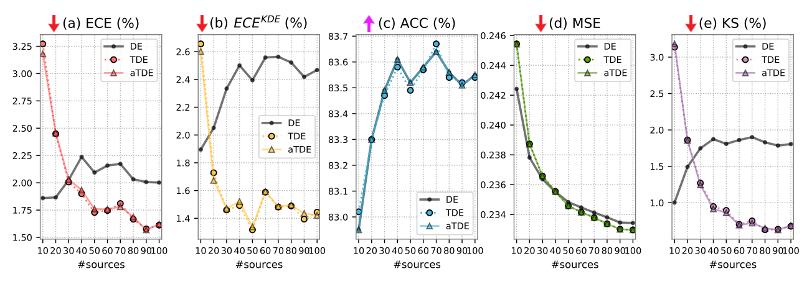
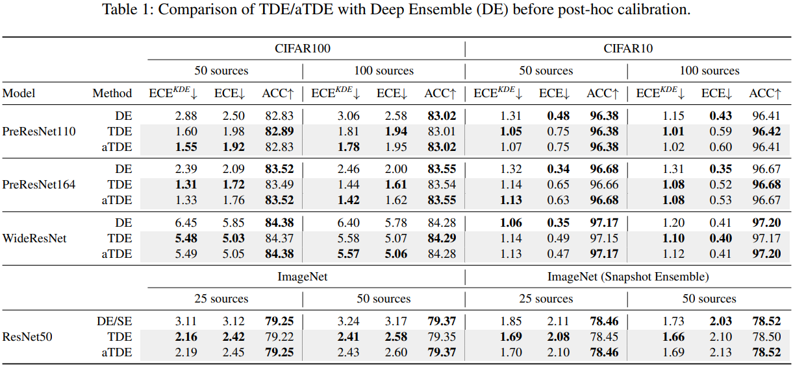

# Truth Discovery for DNN Uncertainty Calibration
<!---
-->

<br />

<div align="center">
  Improving Uncertainty Calibration of Deep Neural Networks via Truth Discovery and Geometric Optimization
</div>

<br />

<div align="center">
  37th Conference on Uncertainty in Artificial Intelligence (UAI 2021)
</div>

<div align="center">
  <a href="https://arxiv.org/abs/2106.14662">arXiv</a>
</div>

<div align="center">
  <a href="https://proceedings.mlr.press/v161/ma21a.html">PMLR</a>
</div>

<br />
<br />

## Introduction

Based on Deep Ensemble, we use *truth discovery* within the probability simplex to find the truth vector, which is better than the naive mean ensemble, w.r.t uncertainty. Further, we use geometric optimization to ensure the accuracy is preserved provably, as shown as follows:

<p align="center">
  
</p>

## Prerequisites

See "requirements.txt" for installation. Then download our logits from [Google Drive](https://drive.google.com/drive/folders/1SLErVXqm2jxRBhQGZkoy7EPgM-_1e7kR?usp=sharing) and store them in "./pitfalldee/megacache". Note that due to the limited space in my cloud storage, only a small portion of logits are shared; however, you are free to use your own logits, and see [pytorch-ensembles](https://github.com/SamsungLabs/pytorch-ensembles) for a complete list of models/datasets used in our paper.

## Reproducing the results

Run jupyter notebook "UN_all_cifar.ipynb" to reproduce the following results:

<p align="center">
  
</p>

and

<p align="center">
  
</p>

Modify "logits_file" to switch between different datasets/models.

## References

If you find the software useful please consider citing:

```
@inproceedings{ma2020truth,
  title={Improving Uncertainty Calibration of Deep Neural Networks via Truth Discovery and Geometric Optimization},
  author={Ma, Chunwei and Huang, Ziyun and Xian, Jiayi and Gao, Mingchen and Xu, Jinhui},
  booktitle={Uncertainty in Artificial Intelligence (UAI)},
  pages={75-85},
  year={2021},
  organization={PMLR}
}
```

<!---
-->

**Acknowledgments**

In this project we use (parts of) the official implementations of the following works:

* [spline-calibration](https://github.com/kartikgupta-at-anu/spline-calibration)
* [pytorch-ensembles](https://github.com/SamsungLabs/pytorch-ensembles)
* [Mix-n-Match-Calibration](https://github.com/zhang64-llnl/Mix-n-Match-Calibration)

We thank the respective authors for open-sourcing their methods, which makes this work possible.

If you have any problem please [contact me](mailto:chunweim@buffalo.edu).
