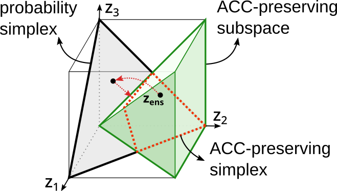

# Truth Discovery Promotes Uncertainty Calibration
<!---
-->

<br />

<div align="center">
  Improving Uncertainty Calibration of Deep Neural Networks via Truth Discovery and Geometric Optimization
</div>

<br />

<div align="center">
  37th Conference on Uncertainty in Artificial Intelligence (UAI 2021)
</div>

<div align="center">
  <a href="https://arxiv.org/abs/2106.14662">arXiv</a>
</div>

<div align="center">
  <a href="https://proceedings.mlr.press/v161/ma21a.html">PMLR</a>
</div>



<br />
<br />

If you find the software useful please consider citing:

```
@inproceedings{ma2020truth,
  title={Improving Uncertainty Calibration of Deep Neural Networks via Truth Discovery and Geometric Optimization},
  author={Ma, Chunwei and Huang, Ziyun and Xian, Jiayi and Gao, Mingchen and Xu, Jinhui},
  booktitle={Uncertainty in Artificial Intelligence (UAI)},
  pages={75-85},
  year={2021},
  organization={PMLR}
}
```

<!---
Acknowledgments
In this project we use (parts of) the official implementations of the followin works:

XX (XX)
XX (XX)
XX
We thank the respective authors for open-sourcing their methods.

If you have any problem please [contact me](mailto:chunweim@buffalo.edu).
-->

